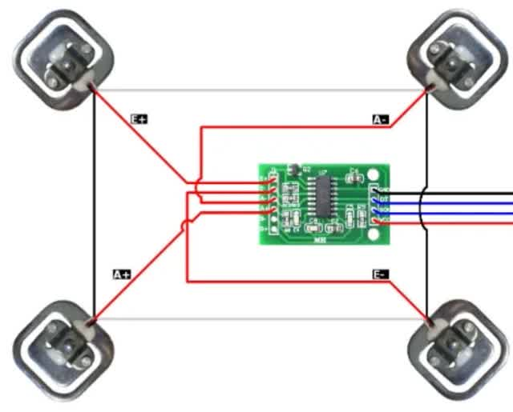
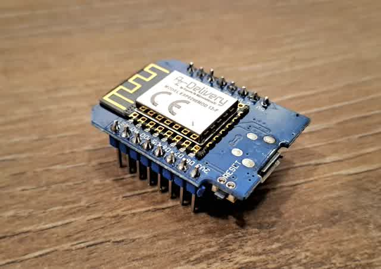
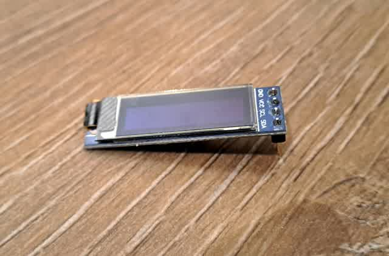

# Arduino-Bathroom-Scale

This repository is mainly used to manage and document my development of a bathroom scale. The development was started by myself, Rouven Bröckelmann, on 11.10.2024. The development was started on 11.10.2024 by myself Rouven Bröckelmann and will include the construction of a scale using Arduino as well as a corresponding web interface in VueJS.

## Changelog

 <h3> 11.10.24 Hardware </h3> 

Since I've enjoyed tinkering with Arduino since my school days, I decided to use components that I already own. On the one hand, there is the ESP8266 d1 mini development board, a microcontroller with built-in Wifi function, which I have already had good experiences with. On the other hand, I use the 0.91 inch OLED display SSD1306 to display the weight directly. The only components I buy are the load cells which are read by an HX711. There are four cells, each with a load capacity of up to 50 kg, which are connected in series, which results a load capacity of around 200kg. 
<kbd> </kbd>
<kbd> </kbd>
<kbd> </kbd>

